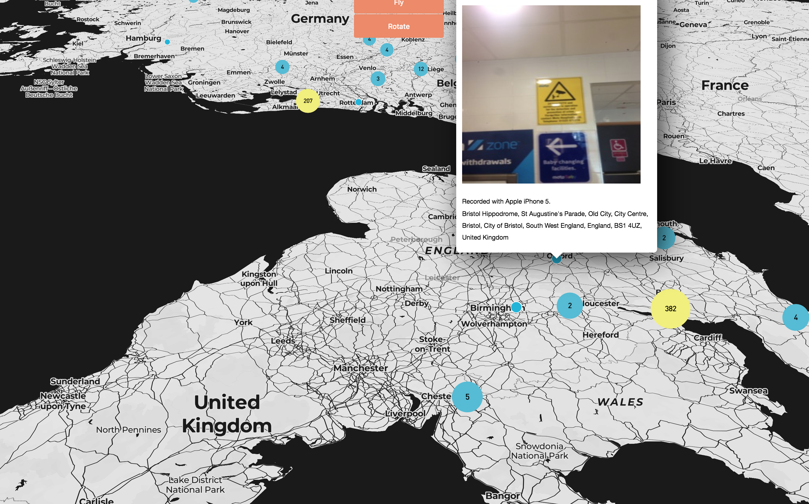

# signs-of-surveillance-web
web based implementation of SignsOfSurveillance mapping project

http://signsofsurveillance.com

http://buzzo.com

dependencies

 * leaflet.js library for mapping elements https://leafletjs.com
 * piexif.js for EXIF data extraction https://github.com/hMatoba/piexifjs
 * date.js for parsing of EXIF datetime data https://github.com/datejs
 * Javascript load image library https://github.com/blueimp/JavaScript-Load-Image
 * using reverse GeoCoding from nominatim.openstreetmap.org

* development-osm branch to switch from mapbox to openstreetmap for tile serving and reverse geo-coding

